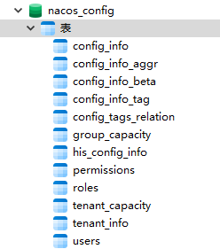
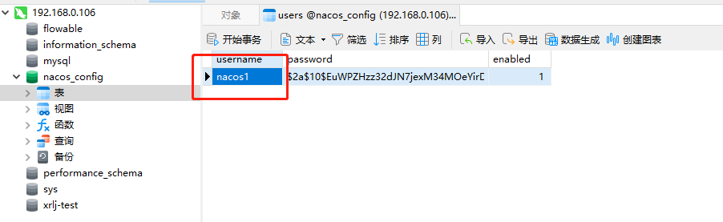

# 定制配置文件

Nacos本身是基于Spring Boot开发的。配置文件在目录`conf`中。可以修改启动配置文件中的各种相关参数，以便定制自己的运行环境。
```shell
[root@server-dev-01 conf]# ls
1.4.0-ipv6_support-update.sql  application.properties  application.properties.example  cluster.conf.example  nacos-logback.xml  nacos-mysql.sql  schema.sql
```
可以下载一份`application.properties.example`文件，按自己需求修改系统参数。实际的启动配置文件是`application.properties`。

#### 配置Mysql8

1. 创建数据库`nacos_config`。字符集：`utf8`，排序规则：`utf8_bin`。
2. 运行数据库脚本。脚本在`conf`目录中的`nacos-mysql.sql`。



3. 修改`application.properties`配置文件相关配置项。如下：
```text
#*************** Config Module Related Configurations ***************#
### If use MySQL as datasource:
# spring.datasource.platform=mysql

### Count of DB:
# db.num=1

### Connect URL of DB:
# db.url.0=jdbc:mysql://127.0.0.1:3306/nacos?characterEncoding=utf8&connectTimeout=1000&socketTimeout=3000&autoReconnect=true&useUnicode=true&useSSL=false&serverTimezone=UTC
# db.user.0=nacos
# db.password.0=nacos
```
修改上面信息如下：
```text
#*************** Config Module Related Configurations ***************#
### If user MySQL as datasource:
# 指定数据源为 MySQL
spring.datasource.platform=mysql

### Count of DB:
# 数据库实例数量
db.num=1

# 数据库连接信息，如果是 MySQL 8.0+ 版本需要添加 serverTimezone=Asia/Shanghai
### Connect URL of DB:
db.url.0=jdbc:mysql://127.0.0.1:3910/nacos_config?characterEncoding=utf8&connectTimeout=1000&socketTimeout=3000&autoReconnect=true&serverTimezone=Asia/Shanghai
db.user=root
db.password=123456
```

4. 启动

新的版本默认的是`mysql8`的驱动包，启动日志：
```shell
/server/java/jdk8/bin/java -Djava.ext.dirs=/server/java/jdk8/jre/lib/ext:/server/java/jdk8/lib/ext  -Xms512m -Xmx512m -Xmn256m -Dnacos.standalone=true -Dnacos.member.list= -Xloggc:/server/nacos-server/nacos/logs/nacos_gc.log -verbose:gc -XX:+PrintGCDetails -XX:+PrintGCDateStamps -XX:+PrintGCTimeStamps -XX:+UseGCLogFileRotation -XX:NumberOfGCLogFiles=10 -XX:GCLogFileSize=100M -Dloader.path=/server/nacos-server/nacos/plugins/health,/server/nacos-server/nacos/plugins/cmdb,/server/nacos-server/nacos/plugins/selector -Dnacos.home=/server/nacos-server/nacos -jar /server/nacos-server/nacos/target/nacos-server.jar  --spring.config.additional-location=file:/server/nacos-server/nacos/conf/ --logging.config=/server/nacos-server/nacos/conf/nacos-logback.xml --server.max-http-header-size=524288

         ,--.
       ,--.'|
   ,--,:  : |                                           Nacos 2.1.1
,`--.'`|  ' :                       ,---.               Running in stand alone mode, All function modules
|   :  :  | |                      '   ,'\   .--.--.    Port: 8848
:   |   \ | :  ,--.--.     ,---.  /   /   | /  /    '   Pid: 8488
|   : '  '; | /       \   /     \.   ; ,. :|  :  /`./   Console: http://10.0.2.15:8848/nacos/index.html
'   ' ;.    ;.--.  .-. | /    / ''   | |: :|  :  ;_
|   | | \   | \__\/: . ..    ' / '   | .; : \  \    `.      https://nacos.io
'   : |  ; .' ," .--.; |'   ; :__|   :    |  `----.   \
|   | '`--'  /  /  ,.  |'   | '.'|\   \  /  /  /`--'  /
'   : |     ;  :   .'   \   :    : `----'  '--'.     /
;   |.'     |  ,     .-./\   \  /            `--'---'
'---'        `--`---'     `----'

2022-10-19 12:03:16,973 INFO Tomcat initialized with port(s): 8848 (http)

2022-10-19 12:03:17,040 INFO Root WebApplicationContext: initialization completed in 1965 ms

2022-10-19 12:03:19,274 INFO Adding welcome page: class path resource [static/index.html]

2022-10-19 12:03:19,550 WARN You are asking Spring Security to ignore Ant [pattern='/**']. This is not recommended -- please use permitAll via HttpSecurity#authorizeHttpRequests instead.

2022-10-19 12:03:19,551 INFO Will not secure Ant [pattern='/**']

2022-10-19 12:03:19,585 INFO Will secure any request with [org.springframework.security.web.context.request.async.WebAsyncManagerIntegrationFilter@2a3591c5, org.springframework.security.web.context.SecurityContextPersistenceFilter@48c35007, org.springframework.security.web.header.HeaderWriterFilter@7383eae2, org.springframework.security.web.csrf.CsrfFilter@55787112, org.springframework.security.web.authentication.logout.LogoutFilter@6d0b5baf, org.springframework.security.web.savedrequest.RequestCacheAwareFilter@6722db6e, org.springframework.security.web.servletapi.SecurityContextHolderAwareRequestFilter@4ae33a11, org.springframework.security.web.authentication.AnonymousAuthenticationFilter@34a75079, org.springframework.security.web.session.SessionManagementFilter@7c7d3c46, org.springframework.security.web.access.ExceptionTranslationFilter@21d8bcbe]

2022-10-19 12:03:19,601 INFO Exposing 1 endpoint(s) beneath base path '/actuator'

2022-10-19 12:03:19,648 INFO Tomcat started on port(s): 8848 (http) with context path '/nacos'

2022-10-19 12:03:19,668 INFO Nacos started successfully in stand alone mode. use external storage

2022-10-19 12:03:39,853 INFO Initializing Servlet 'dispatcherServlet'

2022-10-19 12:03:39,854 INFO Completed initialization in 1 ms

```

*如果是nacos旧的版本，修改配置文件连接mysql8后，启动报错。是因为应用中缺少`mysql8`的驱动包。要添加新的驱动包。*

5. 验证是否成功配置`mysql`



如上图，修改`nacos`用户名。打开控制台，再用`nacos`用户名登录将无法登录。改回即可。


